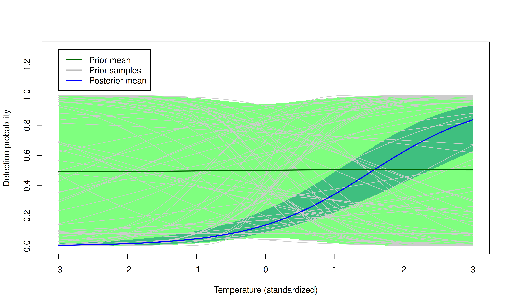

## {content-align="center" style="font-size: 160%;"}

<br>

<center>
Binomial $N$-mixture models: <br> simulation, fitting, and prediction

<br>

::: {style="font-size: 80%;"}
WILD(FISH) 8390 <br>
Inference for Models of Fish and Wildlife Population Dynamics <br>
:::

<center>
  


# Overview {visibility="hidden"}


## Overview

::: {style="font-size: 85%;"}

We're often more interested in abundance than occupancy.

<br>

::: {.fragment}
Even if you're interested in occupancy, you get it for free by modeling abundance. 
:::

<br>

::: {.fragment}
Occupancy isn't useful if all sites are occupied. 
:::

<br>

::: {.fragment}
Binomial $N$-mixture models are useful for studying spatial variation in abundance if we have repeated count data, instead of repeated detection data.
:::

:::


## Binomial $N$-mixture model

::: {style="font-size: 75%;"}

State model (with Poisson assumption)
$$
\begin{gather*}
    \mathrm{log}(\lambda_i) = \beta_0 + \beta_1 {\color{blue} x_{i1}} +
    \beta_2 {\color{blue} x_{i2}} + \cdots \\
    N_i \sim \mathrm{Poisson}(\lambda_i)
  \end{gather*}
$$
  
Observation model
$$
\begin{gather*}
    \mathrm{logit}(p_{ij}) = \alpha_0 + \alpha_1 {\color{blue} x_{i1}}
    + \alpha_2 {\color{Purple} w_{ij}} + \cdots \\
    y_{ij} \sim \mathrm{Binomial}(N_i, p_{ij})
\end{gather*}
$$
  
:::
  
  
::: {style='font-size: 60%;'}
Definitions <br>
  $\lambda_i$ -- Expected value of abundance at site $i$ <br>
  $N_i$ -- Realized value of abundance at site $i$ <br>
  $p_{ij}$ -- Probability of detecting \alert{an individual} at site $i$ on occasion $j$ <br>
  $y_{ij}$ -- Count data <br>
  $\color{blue} x_1$ and $\color{blue} x_2$ -- site covariates <br>
  $\color{Purple} w$ -- observation covariate
:::


# Simulation


## Simulation -- No covariates
  
::: {style="font-size: 80%;"}

```{r}
#| label: sim-nocov1
nSites <- 100
nVisits <- 4
set.seed(3439)                         # Make it reproducible
lambda1 <- 2.6                         # Expected value of N at each site
N1 <- rpois(n=nSites, lambda=lambda1)  # Realized values
```
  
  Detection probability and data
```{r}
#| label: sim-nocov2
p1 <- 0.3
y1 <- matrix(NA, nrow=nSites, ncol=nVisits)
for(i in 1:nSites) {
    y1[i,] <- rbinom(nVisits, size=N1[i], prob=p1)
}
```
  
  
Data and latent abundance
```{r}
#| label: N1y1
cbind(y1, N1)[1:5,]
```

:::


## Simulation -- Covariates
  
::: {style="font-size: 80%;"}

```{r}
#| label: sim-cov1
forest <- factor(sample(c("Hardwood", "Mixed", "Pine"), nSites, replace=TRUE))
forestMixed <- ifelse(forest=="Mixed", 1, 0)        ## Dummy
forestPine <- ifelse(forest=="Pine", 1, 0)          ## Dummy
temp <- matrix(rnorm(nSites*nVisits), nrow=nSites, ncol=nVisits)
```
<br>

Coefficients, $\lambda$, and $p$
```{r}
#| label: nsim-cov2
#| size: 'scriptsize'
beta0 <- 0; beta1 <- -1; beta2 <- 1
lambda2 <- exp(beta0 + beta1*forestMixed + beta2*forestPine)
alpha0 <- -2; alpha1 <- 1
p2 <- plogis(alpha0 + alpha1*temp)
```
<br>

Simulate occupancy and detection data
```{r}
#| label: sim-cov3
#| size: 'scriptsize'
N2 <- rpois(nSites, lambda=lambda2)         ## local abundance 
y2 <- matrix(NA, nrow=nSites, ncol=nVisits)
for(i in 1:nSites) {
    y2[i,] <- rbinom(nVisits, size=N2[i], prob=p2[i,])
}
```

:::

## Simulated data

::: {style="font-size: 85%;"}

::: {.columns}
::: {.column width='40%'}
      
Observations
```{r}
#| label: sim-nocov-dat
y2[1:19,]
```
:::
::: {.column width='5%'}
:::
::: {.column width='55%'}


Summary stats
    
Detections at each site
```{r}
#| label: sim-nocov-ss1
# Max count at each site
maxCounts <- apply(y2, 1, max) 
table(maxCounts)              
```

```{r}
#| label: sim-nocov-ss2
naiveOccupancy <- sum(maxCounts>0)/nSites
naiveOccupancy 
```


Observed abundance
```{r}
#| label: sim-nocov-ss3
naiveAbund <- sum(maxCounts)
naiveAbund
```
```{r}
#| label: un
#| include: false
library(unmarked)
```
:::
:::

:::


# Prediction


## Prepare data in 'unmarked'

::: {style="font-size: 80%;"}

```{r}
#| label: un-umf
umf <- unmarkedFramePCount(y=y2, siteCovs=data.frame(forest), obsCovs=list(temp=temp))
summary(umf)
```

:::


## Fit the model -- without covariates

::: {style="font-size: 60%;"}

`pcount` is similar to `occu`, but there's a new argument (`K`) that should be an integer much greater than the highest possible value of local abundance. 
```{r}
#| label: un-fit0
fm0 <- pcount(~1 ~1, umf, K=100)    
fm0
```

::: {.fragment}
We can use `backTransform` to obtain an estimate of expected abundance
at each site (because there aren't covariates):
```{r}
#| label: back
#| size: 'tiny'
backTransform(fm0, type="state")
```
:::


:::


## Fit the model -- with covariates

::: {style="font-size: 65%;"}

Detection depends on `temp`. Abundance depends on `forest`.
```{r}
#| label: un-fit
fm <- pcount(~temp ~forest, umf, K=100)    
fm
```

::: .fragment
Compare to actual parameter values:
```{r}
#| label: un-compare
c(beta0=beta0, beta1=beta1, beta2=beta2); c(alpha0=alpha0, alpha1=alpha1)
```
:::
:::


## Make sure $K$ is high enough

```{r}
#| label: width90
#| include: false
oo <- options(width=90)
```
::: {style="font-size: 90%;"}

Estimates should not change when you increase $K$.
  
```{r}
#| label: coef
round(coef(fm), digits=4)
```


::: {.fragment}
Looks good:
  
```{r}
#| label: upK
fm.test <- pcount(~temp ~forest, umf, K=150)    
round(coef(fm.test), digits=4)
```
:::


::: {.fragment}
<br>
If the estimates do change, increase $K$ until they stabilize.
:::

:::


##  Empirical Bayes -- Site-level abundance

```{r}
#| label: ranef
#| out-width: '80%'
#| fig-align: 'center'
#| fig-width: 9
re <- ranef(fm)
plot(re, layout=c(4,3), subset=site%in%1:12, xlim=c(-1, 11), lwd=5)
```


## Total abundance (in surveyed region)

::: {style='font-size: 85%;'}
```{r}
#| label: Ntotal
#| out.width: '40%'
#| fig.align: 'center'
N.total.post <- predict(re, func=sum, nsim=1000)
hist(N.total.post, freq=FALSE, main="", xlab="N total", ylab="Probability")
```
Estimate of total abundance in sampled area, with 95\% CI:
```{r}
#| label: Ntotal-stats
#| size: 'tiny'
c(Estimate=mean(N.total.post), quantile(N.total.post, prob=c(0.025, 0.975)))
```
:::


## Prediction in `unmarked'
  
::: {style='font-size: 80%;'}
Create `data.frame` with prediction covariates. 
  
```{r}
#| label: preddat
#| size: 'footnotesize'
pred.data <- data.frame(forest=c("Hardwood", "Mixed", "Pine"), temp=0) 
```

<br>

::: {.fragment}
Get predictions of $\lambda$ for each row of prediction data.
  
```{r}
#| label: predpsi
#| size: 'footnotesize'
lambda.pred <- predict(fm, newdata=pred.data, type='state', append=TRUE)
```
:::

<br>


::: {.fragment}
View $\lambda$ predictions
  
```{r}
#| label: psi-head
#| size: 'footnotesize'
print(head(lambda.pred), digits=2)
```
:::
:::


## Prediction in `unmarked'

::: {style='font-size: 80%;'}
```{r}
#| label: pred-psi1
#| fig.width: 7
#| fig.height: 5.5
#| out.width: '60%'
#| fig.align: 'center'
bpx <- barplot(lambda.pred$Predicted, ylab="Expected value of abundance", #col="blue",
               ylim=c(0,3.5), names=lambda.pred$forest, xlab="Forest type"); box()
arrows(bpx, lambda.pred$Predicted, bpx, lambda.pred$Predicted+lambda.pred$SE,
       angle=90, length=0.1)
```
:::


## The BUGS model -- without covariates {code-overflow="wrap"}

[Nmix-model.jag](Nmix-model.jag)

```{r}
#| label: bugs0
#| size: 'scriptsize'
#| echo: false
#| comment: ''
#| background: 'beige'
writeLines(readLines("Nmix-model.jag"))
```

```{r}
#| label: jagsUI0
#| include: false
library(jagsUI)
```

## Data, inits, and parameters

Put data in a named list
  
```{r}
#| label: bugs-data0
#| size: 'scriptsize'
jags.data0 <- list(y=y2, nSites=nSites, nOccasions=nVisits)
```
  
Initial values
  
```{r}
#| label: bugs-inits0
#| size: 'scriptsize'
jags.inits0 <- function() list(lambda=runif(1), p=runif(1), N=maxCounts)
```

  
Run it
  
```{r}
#| label: bugs-pars0
#| results: 'hide'
#| message: false
#| cache: false
jags0.post.samples <- jags.basic(data=jags.data0, inits=jags.inits0,
                                 parameters.to.save=c("lambda", "p"), 
                                 model.file="Nmix-model.jag",
                                 n.chains=3, n.adapt=100, n.burnin=0,
                                 n.iter=2000, parallel=TRUE)
```


## The BUGS model -- with covariates


[Nmix-model-covs.jag](Nmix-model-covs.jag)

```{r}
#| label: bugs
#| size: 'scriptsize'
#| echo: false
#| comment: ''
#| background: 'beige'
writeLines(readLines("Nmix-model-covs.jag"))
```
```{r}
#| label: jagsUI
#| include: false
library(jagsUI)
```


## Data, inits, and parameters

Put data in a named list
  
```{r}
#| label: bugs-data
#| size: 'small'
jags.data <- list(y=y2, temp=temp,
                  forestMixed=forestMixed,
                  forestPine=forestPine,
                  nSites=nSites, nOccasions=nVisits)
```


Initial values
  
```{r}
#| label: bugs-inits
#| size: 'small'
jags.inits <- function() {
    list(beta0=rnorm(1), alpha0=rnorm(1), N=maxCounts)
}
```

Parameters to monitor
  
```{r}
#| label: bugs-pars
#| size: 'small'
jags.pars <- c("beta0", "beta1", "beta2",
               "alpha0", "alpha1", "totalAbundance")
```


## MCMC
  
```{r}
#| label: bugs-mcmc
#| size: 'scriptsize'
#| message: false
#| results: 'hide'
#| cache: true
library(jagsUI)
jags.post.samples <- jags.basic(data=jags.data, inits=jags.inits,
                                ## Monitor each "N[i]" 
                                parameters.to.save=c(jags.pars, "N"), 
                                model.file="Nmix-model-covs.jag",
                                n.chains=3, n.adapt=100, n.burnin=0,
                                n.iter=2000, parallel=TRUE)
```


## Summarize output
```{r}
#| label: bugs-sum
summary(jags.post.samples[,jags.pars])
```


## Local abundance
```{r}
#| label: localN
#| out-width: '70%'
#| fig-align: 'center'
#| fig-height: 7
#| fig-width: 10
plot(jags.post.samples[,paste0("N[", 1:4, "]")])
```


## Traceplots and density plots

```{r}
#| label: bugs-plot1
#| out-width: "70%"
#| fig-align: 'center'
#| fig-width: 10
plot(jags.post.samples[,jags.pars[1:3]])
```


## Traceplots and density plots

```{r}
#| label: bugs-plot2
#| out-width: "70%"
#| fig-align: 'center'
#| fig-width: 10
plot(jags.post.samples[,jags.pars[4:5]])
```

## Bayesian prediction
  
::: {style="font-size: 80%;"}

First, extract the $p$ coefficients
  
```{r}
#| label: psi-coefs
#| size: 'scriptsize'
p.coef.post <- as.matrix(jags.post.samples[,c("alpha0","alpha1")])
head(p.coef.post, n=4)
```
  
Create prediction matrix, one row for each MCMC iteration.
  
```{r}
#| label: p-predmat
#| size: 'scriptsize'
n.iter <- nrow(p.coef.post)
temp.pred <- seq(-3, 3, length=50)
p.post.pred <- matrix(NA, nrow=n.iter, ncol=length(temp.pred))
```
  
Predict $p$ for each MCMC iteration.
  

```{r}
#| label: psi-pred-bayes
#| size: 'scriptsize'
for(i in 1:n.iter) {
    p.post.pred[i,] <- plogis(p.coef.post[i,"alpha0"] +
                              p.coef.post[i,"alpha1"]*temp.pred)
}
```

:::


## Bayesian prediction

::: {style="font-size: 80%;"}


```{r, echo=-1}
#| label: psi-pred-post-meanCI
#| fig.align: 'center'
#| out.width: '70%'
#| fig.height: 5
#| cache: false
#| dpi: 200
par(mai=c(0.9,0.9,0.1,0.1))  
plot(temp.pred, p.post.pred[1,], type="l", xlab="Temperature (standardized)",
     ylab="Detection probability", ylim=c(0, 1), col=gray(0.8))
for(i in seq(1, n.iter, by=10)) {  ## Thin by 10
    lines(temp.pred, p.post.pred[i,], col=gray(0.8))  }
pred.post.mean <- colMeans(p.post.pred)
pred.post.lower <- apply(p.post.pred, 2, quantile, prob=0.025)
pred.post.upper <- apply(p.post.pred, 2, quantile, prob=0.975)
lines(temp.pred, pred.post.mean, col="blue")
lines(temp.pred, pred.post.lower, col="blue", lty=2)
lines(temp.pred, pred.post.upper, col="blue", lty=2)
```

:::

## Prior sensitivity

Questions:

- What are the implied priors on $\lambda$ and $p$?
- What would be the consequence of changing the priors?

<br>

::: {.fragment}
[Prior predictive checks]{style="color: blue;"} can help us answer these questions.
:::

<br>

::: {.fragment}
Prior prediction can be acheived by replacing the data with missing values.
:::


## Prior sampling

Replace data with missing values
  
```{r}
#| label: bugs-data2
jags.data2 <- jags.data
jags.data2$y[] <- NA     # Replace data with missing values
```

<br>

::: {.fragment}
Fit model (Really, we're just sampling from the prior)

```{r}
#| label: bugs-mcmc-prior
#| message: false
#| results: 'hide'
#| cache: true
jags.prior.samples <- jags.basic(data=jags.data2, inits=jags.inits,
                                 parameters.to.save=jags.pars,
                                 model.file="Nmix-model-covs.jag",
                                 n.chains=3, n.adapt=100, n.burnin=0,
                                 n.iter=2000, parallel=TRUE)
```
:::


## Prior summary

```{r}
#| label: summary-prior
summary(jags.prior.samples)
```


## Prior prediction

Push the prior samples through the model to predict $p$

```{r}
#| label: psi-coefs-prior
p.coef.prior <- as.matrix(jags.prior.samples[,c("alpha0","alpha1")])
p.prior.pred <- matrix(NA, nrow=n.iter, ncol=length(temp.pred))
for(i in 1:n.iter) {
    p.prior.pred[i,] <- plogis(p.coef.prior[i,"alpha0"] +
                               p.coef.prior[i,"alpha1"]*temp.pred)
}
```

## Bayesian prediction

::: {style="font-size: 75%;"}

Compute prior mean and 95\% CI for $p$ predictions
```{r}
#| label: prior-post-pred-1
pred.prior.mean <- colMeans(p.prior.pred)
pred.prior.lower <- apply(p.prior.pred, 2, quantile, prob=0.025)
pred.prior.upper <- apply(p.prior.pred, 2, quantile, prob=0.975)
```
  
Show credible regions using shaded polygons. Include a few prior prediction lines.

```{r}
#| label: prior-post-pred-2
#| fig.height: 6
#| dev: 'png'
#| dpi: 200
#| fig.show: 'hide'
plot(temp.pred, p.post.pred[1,], type="n", xlab="Temperature (standardized)",
     ylab="Detection probability", ylim=c(0, 1.3), col=gray(0.8))
polygon(x=c(temp.pred, rev(temp.pred)),
        y=c(pred.post.lower, rev(pred.post.upper)),
        col=rgb(0,0,1,0.5), border=NA)                   # Post CI
polygon(x=c(temp.pred, rev(temp.pred)),
        y=c(pred.prior.lower, rev(pred.prior.upper)),
        col=rgb(0,1,0,0.5), border=NA)                   # Prior CI
for(i in seq(1, n.iter, by=100)) {  ## Thin by 100
    lines(temp.pred, p.prior.pred[i,], col=gray(0.8))  } # Prior preds
lines(temp.pred, pred.post.mean, col="blue", lwd=2)
lines(temp.pred, pred.prior.mean, col="darkgreen", lwd=2)
legend(-3, 1.3, c("Prior mean", "Prior samples", "Posterior mean"),
       col=c("darkgreen", "grey", "blue"), lwd=2)
```

:::

## Prior and posterior prediction
  



## Prior predictive recap

::: {style='font-size: 80%;'}


There are two common strategies for specifying priors:

1. Use uniform/flat priors to obtain results that will often be similar to likelihood-based methods.
2. Use priors that reflect available information.


::: {.fragment}
The second approach can be used even if there isn't much prior
information available. Priors can allow for the
possibility of being "surprised" by the data, but without
putting most of the prior weight on extreme values. 
:::
  
  
::: {.fragment}
Often, highly diffuse priors on the link scale result in most of the
prior weight being on extreme values on the natural scale. 
:::
  
  
::: {.fragment}
Prior predictive checks can be used to assess this possibility, and
should be a standard component of Bayesian analysis.
:::

:::


# Assignment


## Assignment

Create a self-contained R script or Rmarkdown/Quarto file to do the following:

<br>
  
Using the simulated data, compare the prior and posterior predictive distributions of $\lambda$ for each of the 3 forest types. ^[Hint: because forest type is categorical (not continuous), you can visualize the prior and posterior predictive distributions as histograms for each forest type.]

<br>
  
  Upload your `.R`, `.Rmd`, or `.qmd` file to ELC by 5:00 PM on Tuesday.


