---
format:
  revealjs:
    theme: default
    pagetitle: "Lecture 1 -- Overview"
    slide-number: true
    toc: false
    margin: 0.1
lang: en
---

# Overview section {visibility="hidden"}

## {.center content-align="center"}

::: {.center style="font-size: 130%;"}
**Inference for Models of Fish and Wildlife Population Dynamics**
:::

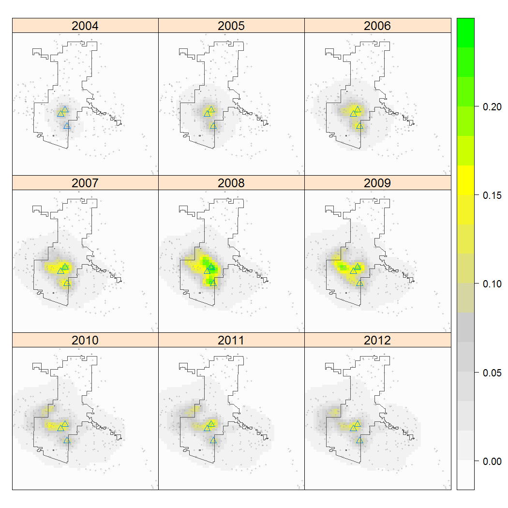{width="70%" fig-align="center" fig-alt="Colonization maps"}

::: {style="font-size: 80%;"}
WILD(FISH) 8390

Richard Chandler
:::

## Overview {style="font-size: 100%;"}

We need models to:

::: {.columns}
::: {.column width="40%"}
- Evaluate hypotheses
- Make predictions
:::
::: {.column width="60%"}
- Forecast future outcomes
- Inform management decisions
:::
:::

::: {.fragment}
Until recently, population models were mainly used in theoretical
settings.
:::

<!-- Hierarchical models make it possible to learn about "hidden" population dynamics by modeling population processes observed with error. -->

## Classical models of population dynamics {style="font-size: 90%;"}

<!-- Classical models of population dynamics provide a critical reference -->
<!-- for developing custom models for specific populations and applications. -->

::: {.fragment}
A working knowledge of the following models is important:

- Exponential growth
- Logistic growth
- Age/stage-structured matrix models
- Metapopulation models
:::

<!-- Classical statistical models are equally important. -->

## Classical statistical models

You should also be familiar with:

- Linear models (including the various ANOVAs)
- Generalized linear models (eg, logistic regression)
- Generalized linear mixed effects models
  

 

::: {.fragment style="font-size: 130%; color: royalblue;"}
How do we bridge the gap between theoretical models and statistical models?
:::

# Examples {visibility="hidden"}

## Example I -- Chiricahua Leopard Frogs

::: {.columns}
::: {.column width="60%"}

::: {style="font-size:90%;"}
Sites are discrete habitat patches.

Surrounding landscape is suitable for movement but not reproduction.

Data are binary detection data.
:::

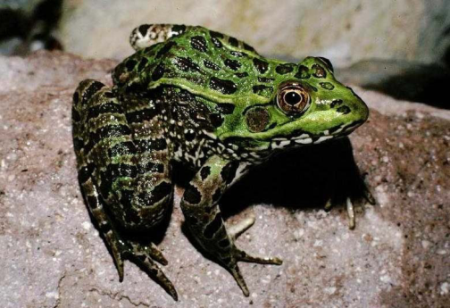{width="65%" fig-align="center"}

:::
::: {.column width="40%"}

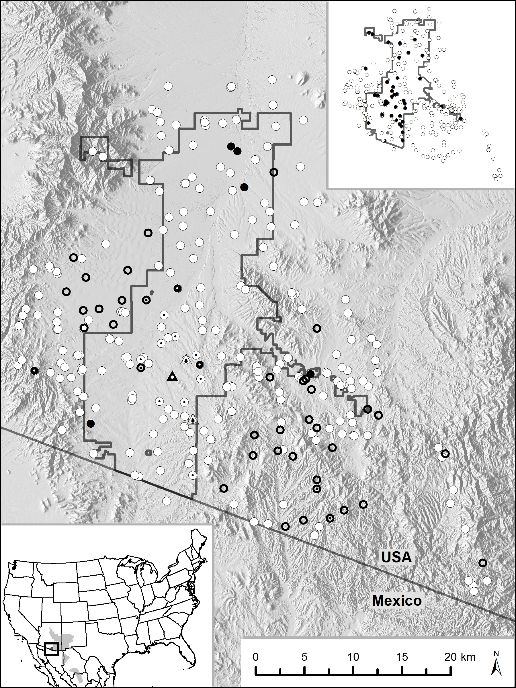{width="100%"}

:::
:::

## Metapopulation ecology

::: {.columns}

::: {.column width="70%"}

One branch of metapopulation theory focuses on distance-dependent
colonization and extinction processes.

 

::: {.fragment}
If we know the patch coordinates and we have data from multiple sites
and multiple time periods, we can fit the models. 
:::

:::

::: {.column width="30%"}
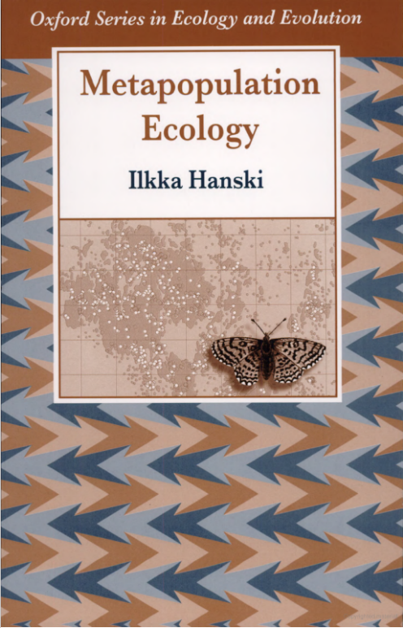
:::

:::

## Recovery Plan

## Avoiding extinction

::: {style="font-size: 85%;"}

Management options 

- Control predators
- Increase hydroperiod in existing wetlands
- Create new wetlands\dots

::: {.fragment}
Restoring just 1 pond, reduced the risk from 4% to 2.5%.

{width="45%" fig-align="center"}
:::

:::

## Colonization Probability Maps

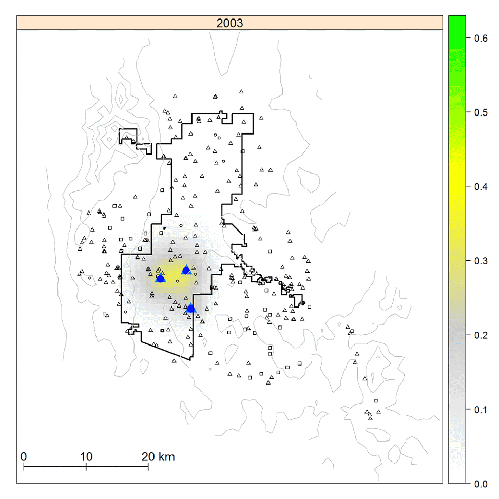{width="50%" fig-align="center"}

## Example II -- Central Georgia Black Bears {style="font-size: 90%;"}

::: {.columns}

::: {.column width="60%" .r-stretch-text}

Genetically isolated population near Macon.

::: {.fragment}
Impacts of hunting had not been evaluated.
:::

::: {.fragment}
Studied using noninvasive genetic mark-recapture.
:::

::: {.fragment}
Hair snares and genotyping yielded individual-level encounter histories.
:::

:::

::: {.column width="40%"}
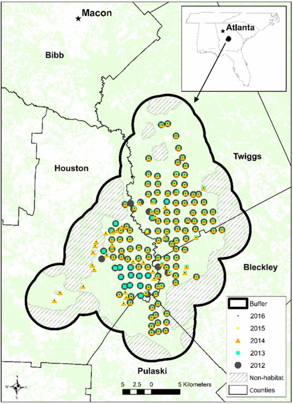
:::

:::

## Harvest theory

::: {.columns}

::: {.column width="60%"}

Theory goes back about a century.

 

Much of it focuses on the importance of density dependence.

 

Think back to "maximum sustainable yield."

:::

::: {.column width="35%"}
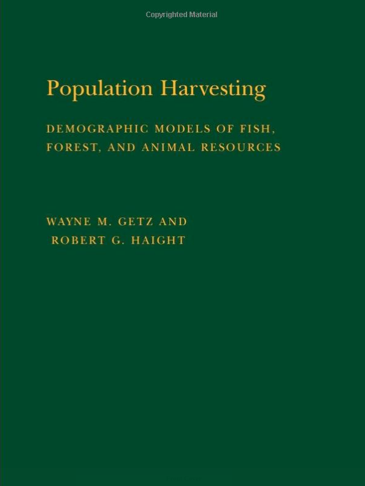
:::

:::

## Central Georgia Black Bear Abundance  {style="font-size: 90%;"}

<!-- Female-based population model revealed population growth. -->

<!-- ^[Hooker et al. (2020, Journal of Wildlife Management)] -->

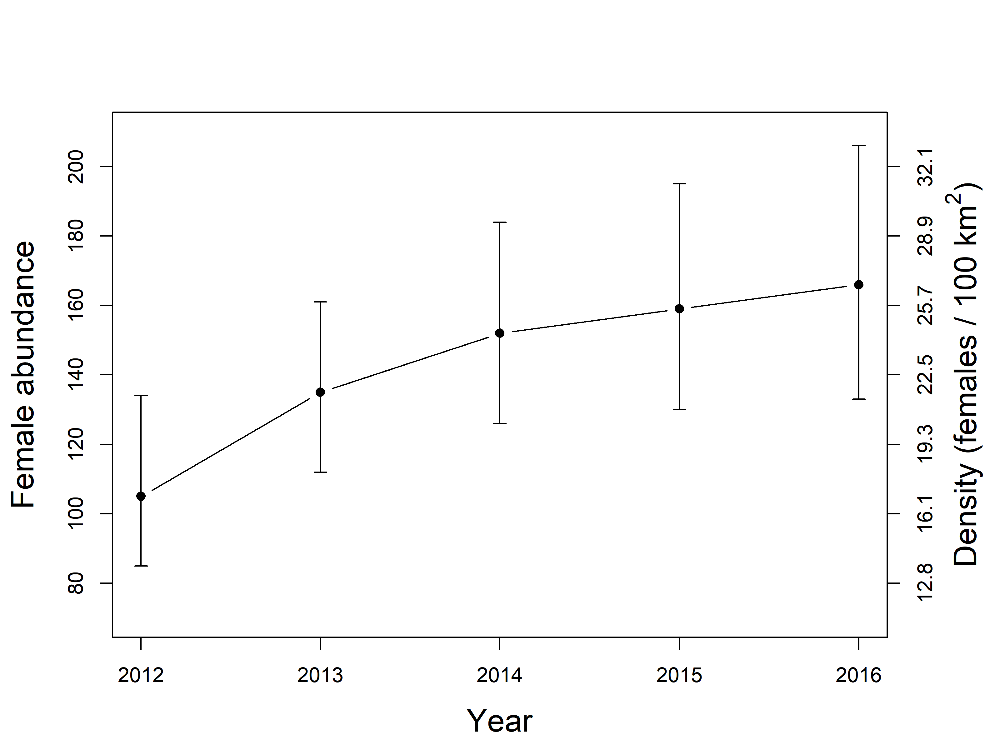{width="60%" fig-align="center"}

## Central Georgia Black Bear Recruitment {style="font-size: 90%;"}

<!-- Population regulated by density-dependent recruitment  -->

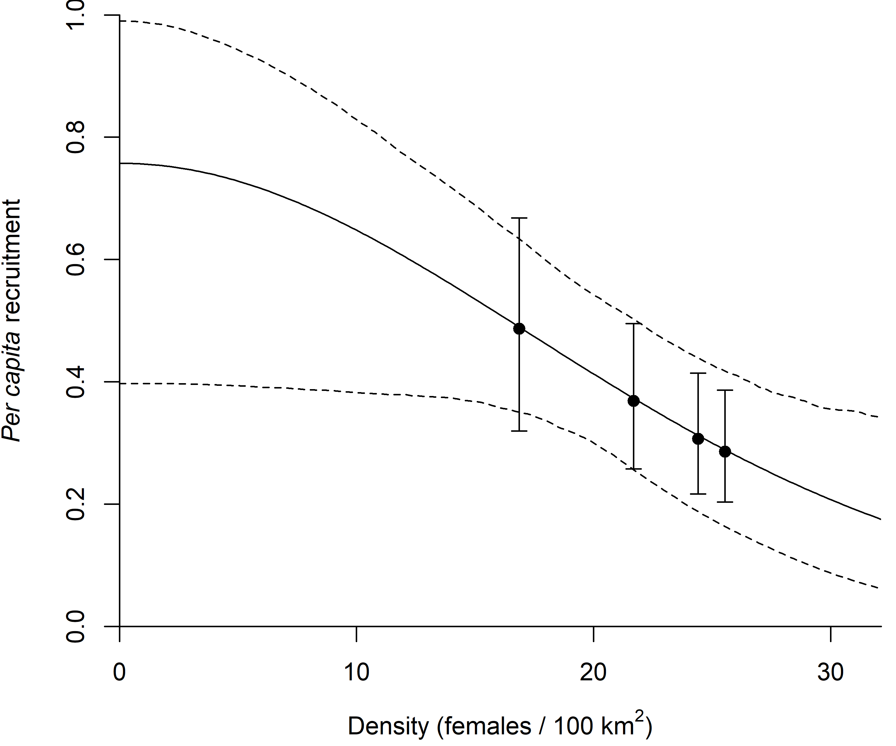{fig-align="center" width="50%"}

## Central Georgia Black Bear Extinction Risk {style="font-size: 90%;"}

<!-- Extinction risk low unless harvest increases by 10 females/year -->

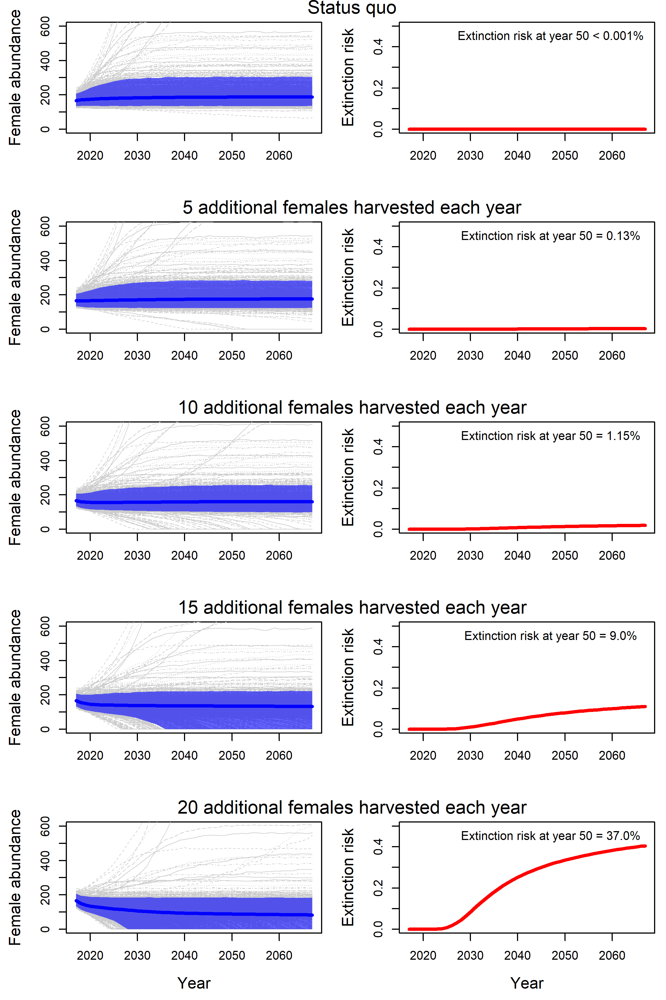{fig-align="center" width="40%"}
 
<!-- 
 -->
<!--    -->
<!-- 
 -->

# Syllabus {style="font-size: 90%;"}

<iframe src="../../IPD-syllabus.pdf" width="50%" height="550px" style="display: block; margin: 0 auto;"></iframe> 

## Books

::: {.columns}

::: {.column width="33%"}
AHM vol I

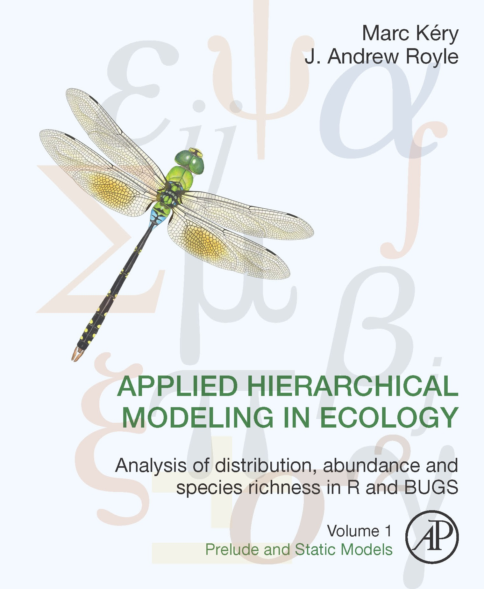{height="350"}
:::

::: {.column width="33%"}
AHM vol II

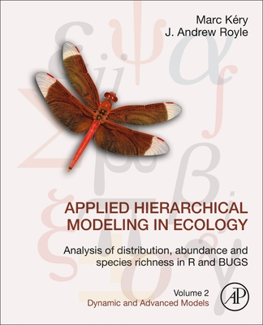{height="350"}
:::

::: {.column width="33%"}
SCR

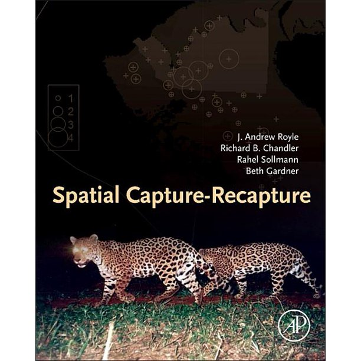{height="350"}
:::

:::

## Recommended reading

::: {.columns}

::: {.column width="50%"}
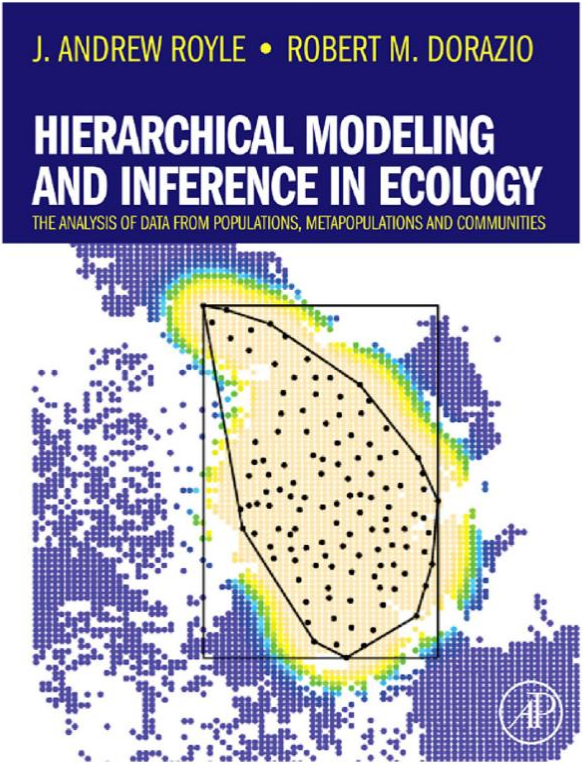{height="500"}
:::

::: {.column width="50%"}
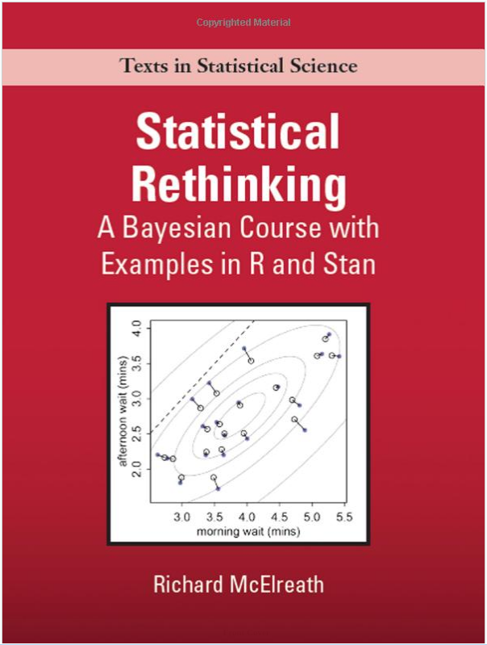{height="500"}
:::

:::

# Assignment {visibility="hidden"}

## For Thursday

Read: Applied Hierarchical Modeling (AHM vol I) chapter 1 

 

Install: [JAGS](https://sourceforge.net/projects/mcmc-jags/files/), 
  [R](https://www.r-project.org/), and the following packages:

- unmarked
- rjags
- jagsUI
  
