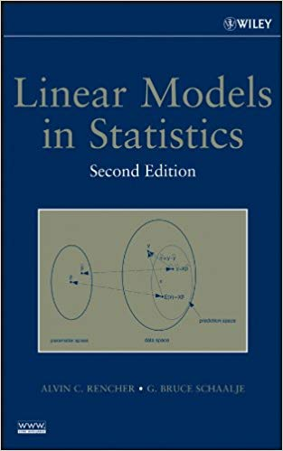
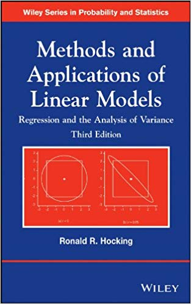

---
format:
  revealjs:
    theme: default
    pagetitle: "Lecture 2 -- Refresher of basic statistical models"
    slide-number: true
    toc: false
    margin: 0.1
lang: en
---


# Overview section {visibility="hidden"}


## {.center content-align="center"}

<center>
::: {.center style="font-size: 140%;"}
**Lecture 2 <br> Refresher of basic statistical models**
:::
</center>


<!-- {width="70%" fig-align="center" fig-alt="Colonization maps"} -->


<center>
::: {style="font-size: 90%;"}
WILD(FISH) 8390

Richard Chandler
:::
</center>


# Linear models {visibility="hidden"}


## Today's Topics

- Linear models
  * Classical
  * Bayesian

<br>

- Generalized linear models
  * Classical
  * Bayesian


## Linear models {style="font-size: 90%;"}

All ANOVAs and fixed-effects regression models are linear models.

<br>

You must understand linear models before you can apply more advanced
models such as GLMs, GAMS, hierarchical models etc...

<center>
{height="350"}
{height="350"}
</center>


## Simple linear regression {.smaller}

Simple linear regression is the most basic linear model.
$$
    \mu_i = \beta_0 + \beta_1 x_i \qquad \qquad
    y_i \sim \mathrm{Norm}(\mu_i, \sigma^2)
$$

::: {.columns}
::: {.column width="50%"}
$y$ is variously called:

- response variable
- outcome variable
- dependent variable
:::

::: {.column width="50%"}

It's worse for $x$

- predictor variable
- explanatory variable
- independent variable
- covariate, exposure, etc...

:::
:::


We observe $x$ and $y$. The expected value of $y_i$ is $\mu_i$.\

We'd like to estimate $\beta_0$ and $\beta_1$, called the
"coefficients".\

A residual is $\varepsilon_i=y_i-\mu_i$. $\sigma^2$ is the variance of
the residuals.


## Simple linear regression example

Suppose your data look like this:

::: {style="font-size: 80%;"}
```{r}
#| label: slr-data
#| echo: true
width <- c(0.30, 0.91, 0.89, 0.24, 0.77, 0.56, 0.59, 0.92, 0.81, 0.59)  ## x
mass <- c(0.08, 0.59, 0.18, 0.17, 0.42, 0.71, 0.49, 0.75, 0.46, 0.04)   ## y
```
:::


::: {.columns}
::: {.column width='50%'}
```{r}
#| label: slr-viz
#| echo: false
#| fig-width: 7
#| fig-height: 7
#| out-width: "5in"
plot(width, mass, xlim=c(0,1), cex.lab=1.3)
abline(lm(mass~width))
```
:::

::: {.column width='50%'}
::: {.fragment}
<br>
Classical inference is easy:
```{r}
#| label: slr-fit
#| size: 'scriptsize'
lm(mass~width)
```
:::
:::
:::


## Bayesian inference with JAGS {style="font-size: 90%;"}

We will use JAGS and the R packages 'rjags' and 'jagsUI'. JAGS can be
downloaded [here](https://sourceforge.net/projects/mcmc-jags/files/).

<br>

The basic steps of Bayesian analysis with JAGS are:

1.  Write a model in the BUGS language in a text file

2.  Put data in a named list

3.  Create a function to generate random initial values

4.  Specify the parameters you want to monitor

5.  Use MCMC to draw posterior samples

6.  Use posterior samples for inference and prediction


## Simple (Bayesian) linear regression

The model is in a text file named `lm.jag`\


```{r}
#| eval: false
#| echo: true
model {

    # Priors
    ## dnorm arguments: mean and precision (1/variance)
    beta0 ~ dnorm(0, 0.1)  ## Prior on intercept  
    beta1 ~ dnorm(0, 0.1)  ## Prior on slope
    sigmaSq ~ dunif(0, 2)  ## Prior on residual variance

    # Model for the data
    for(i in 1:n) {
      mu[i] <- beta0 + beta1*x[i]
      y[i] ~ dnorm(mu[i], 1/sigmaSq)
    }

}
```

Now, put the data in a list and pick some initial values

```{r}
jd.lm <- list(x=width, y=mass, n=length(mass))
ji.lm <- function() list(beta0=rnorm(1), beta1=0, sigmaSq=runif(1))
jp.lm <- c("beta0", "beta1", "sigmaSq")
```

## Simple (Bayesian) linear regression

Use MCMC to draw posterior samples:


## Linear models

A more general depiction of linear models:

$$
  \mu_i = \beta_0 + \beta_1 x_{i1} + \beta_2 x_{i2} + \cdots + \beta_p x_{ip} \\
  y_i \sim \mathrm{Normal}(\mu_i, \sigma^2)
$$

where the $\beta$'s are coefficients, and the $x$ values are predictor
variables (or dummy variables for categorical predictors).


## Interpreting the $\beta$'s

You must be able to interpret the $\beta$ coefficients for *any model*
that you fit to your data. 

A linear model might have dozens of
continuous and categorical predictors variables, with dozens of
associated $\beta$ coefficients. 

Linear models can also include
polynomial terms and interactions.


## Interpreting the $\beta$'s

The intercept $\beta_0$ is the expected value of $y$, when all $x=0$.\
If $x_1$ is a **continuous** explanatory variable:

- $\beta_1$ can usually be interpreted as a *slope* parameter.

- In this case, $\beta_1$ is the change in $y$ resulting from a 1 unit
  change in $x_1$ (while holding the other predictors constant).


## Interpreting $\beta$'s for categorical explanatory variables

Things are more complicated for **categorical** explanatory variables
(i.e., factors) because they must be converted to dummy variables. There
are many ways of creating dummy variables. In `R`, the default method
for creating dummy variables from unordered factors works like this:

- One level of the factor is treated as a [reference level]{.alert}.

- The reference level is associated with the intercept.

- The $\beta$ coefficients for the other levels of the factor are
  differences from the reference level.


## Interpreting $\beta$'s for categorical explanatory variables


## Ruffed grouse data

{width="100%"}


## Ruffed grouse data

{width="100%"}


## Grouse data

Fit a linear model to the abundance data


# Generalized linear models


## Generalized linear models (GLMs)

- The residuals don't have to be normally distributed.

- The response variable can be binary, integer, strictly-positive,
  etc\...

- The variance is not assumed to be constant.

- Useful for manipulative experiments or observational studies, just
  like linear models.


## From linear to generalized linear

Linear model 

$$
\begin{gathered}
    \mu_i = \beta_0 + \beta_1 x_{i1} + \beta_2 x_{i2} + \cdots + \beta_p x_{ip} \\
    y_i \sim \mathrm{Normal}(\mu_i, \sigma^2)  
\end{gathered}
$$ 


Generalized Linear model 

$$
\begin{gathered}
    g(\mu_i) = \beta_0 + \beta_1 x_{i1} + \beta_2 x_{i2} + \cdots + \beta_p x_{ip} \\
    y_i \sim f(\mu_i)
\end{gathered}
$$ 


where\
$g$ is a link function, such as the log or logit link\
$f$ is a probability distribution such as the binomial or Poisson


## Link functions

An inverse link function ($g^{-1}$) transforms values from the
$(-\infty,\infty)$ scale to the scale of interest, such as $(0,1)$ for
probabilities.\

The link function ($g$) does the reverse.\


## Link functions

  Distribution   link name        link equation          inverse link equation
  -------------- --------------- ----------------------- -----------------------------
  Binomial       logit            $\log(\frac{p}{1-p})$   $\frac{\mu}{1 + \exp(\mu)}$
  Poisson        log                 $\log(\lambda)$              $\exp(\mu)$

<br>


  Distribution   link name    link in **R**   inv link in **R**
  -------------- ----------- --------------- -------------------
  Binomial       logit          `qlogis`          `plogis`
  Poisson        log              `log`             `exp`


## Logit link example


{width="\\textwidth"}\


## Logit link example


# Logistic regression


## Logistic Regression

Logistic regression is a specific type of GLM in which the response
variable follows a binomial distribution and the link function is the
logit.\

It would be better to call it "binomial regression" since other link
functions (e.g. the probit) can be used\

Appropriate when the response is binary or a count with an upper limit
Examples:

- Presence/absence studies

- Survival studies

- Disease prevalence studies


## Logistic Regression

$$
\begin{gathered}
      \mathrm{logit}(p_i) = \beta_0 + \beta_1 x_{i1} + \beta_2 x_{i2} + \cdots \\
      y_i \sim \mathrm{Binomial}(N, p_i)
  
\end{gathered}
$$ 

where:\

$N$ is the number of "trials" (e.g. coin flips)\
$p_i$ is the probability of success for sample unit $i$


## Binomial distribution


{width="90%"}


## Binomial distribution


{width="90%"}


## Binomial Distribution

Properties

- The expected value of $y$ is $Np$

- The variance is $Np(1-p)$

Bernoulli distribution

- The Bernoulli distribution is a binomial distribution with a single
  trial ($N=1$)

- Logistic regression is usually done in this context, such that the
  response variable is 0/1 or No/Yes or Bad/Good, etc$\dots$


## Logistic regression example

1.  How could we fit the following model to the grouse data?

$$
\begin{gathered}
     \mathrm{logit}(p_i) = \beta_0 + \beta_1\mathrm{ELEV}_i \\
     y_i \sim \mathrm{Bern}(p_i)
\end{gathered}
$$

2.  How can we predict and graph occurrence probability ($p$) over a
    range of elevations?


## Logistic regression example


# Poisson regression


## Poisson Regression

$$
\begin{gathered}
      \mathrm{log}(\lambda_i) = \beta_0 + \beta_1 x_{i1} + \beta_2 x_{i2} + \cdots + \beta_p x_{ip} \\
      y_i \sim \mathrm{Poisson}(\lambda_i)
  
\end{gathered}
$$ 

where:\
$\lambda_i$ is the expected value of $y_i$\


## Poisson regression

Useful for:

- Count data

- Number of events in time intervals

- Other types of integer data

Properties

- The expected value of $y$ ($\lambda$) is equal to the variance

- This is an assumption of the Poisson model

- Like all assumptions, it can be relaxed if you have enough data


## Poisson distribution


## Log link example


{width="80%"}


## Log link example


{width="80%"}

## Poisson regression simulation

First, create a covariate:


Next, pick values for the coefficients and compute $\lambda_i =
  E(y_i)$:


Now, simulate the response variable $y$:


Finally, fit the model:


## Simple (Bayesian) Poisson regression

The model is in a text file named `glm.jag`\

```{r}
#| eval: false
model {

    # Priors
    beta0 ~ dnorm(0, 0.1) ## Normal prior with mean=0, variance=10
    beta1 ~ dnorm(0, 0.1)

    ## Model for the data
    for(i in 1:n) {
      lambda[i] <- exp(beta0 + beta1*x[i])
      y[i] ~ dpois(lambda[i])
    }

}
```

Now, put the data in a list and pick some initial values


### Simple (Bayesian) Poisson regression

Use MCMC to draw posterior samples:


## Assignment {.smaller}

Create a self-contained R script (or better yet an Rmarkdown file) to do
the following:

1.  Simulate logistic regression data according to
    $y_i \sim \mathrm{Bern}(p_i)$ and $\mathrm{logit}(p_i) = \beta_0
          + \beta_1 x_i$ with $\beta_0=-1$ and $\beta_1=1$. Generate the
    covariate using
    [`x <- rnorm(n=100)`]{style="background-color: inlinecolor"}. Note
    that you will need to use the
    [`rbinom`]{style="background-color: inlinecolor"} function to
    simulate Bernoulli outcomes.

2.  Fit a logistic regression model to the simulated data ($y$ and $x$)
    using the [`glm`]{style="background-color: inlinecolor"} function.
    Create a figure showing $x$ and $y$ with the fitted regression line.
    Use [`predict`]{style="background-color: inlinecolor"} to get the
    fitted line.

3.  Fit the logistic regression model in JAGS. Use
    $\mathrm{Normal}(0, var=10)$ priors for the regression coefficients.

4.  Compare and intepret the estimates of $\beta_0$ and $\beta_1$ from
    the classical analysis and the Bayesian analysis.

Upload your `.R` or `.Rmd` file to ELC by 5:00 PM Tuesday.


